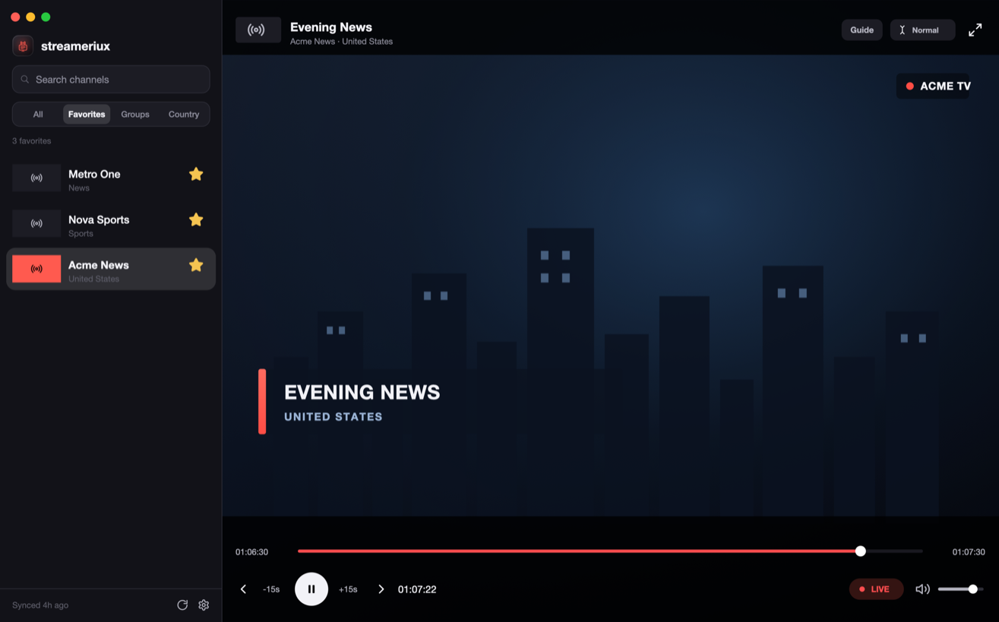

# GPIUX Streamer

A **proof-of-concept** desktop TV/IPTV player, built to see how far two libraries can be pushed together:

- **[Mediabunny](https://mediabunny.dev/)** — pure-JS/WASM container demuxing and audio/video decoding (HLS, MP4, etc.).
- **[GPUIX](https://github.com/remorses/gpuix)** — a React renderer on top of Zed's [GPUI](https://www.gpui.rs/), drawing a native GPU window with no DOM and no Electron.

The whole app is a React tree (`app.tsx`) rendered through GPUIX: channel list on the left, player on the right. There is no `<video>` element and no browser — Mediabunny decodes each frame in JS and the player paints it into a GPUI ``.

**GPUIX + React + TypeScript, no Electron or Tauri.** The UI is written in ordinary React (components, hooks, JSX) in **TypeScript**, but instead of a DOM it renders through **GPUIX** straight into a native GPU window backed by Zed's GPUI. There is **no Chromium, no WebView, no Electron and no Tauri** — no bundled browser engine — just React reconciling a tree of GPU-drawn primitives.



```bash
bun install
bun run dev
```

> [!IMPORTANT]
> **This is a proof of concept, not a product.**
> It ships with **no channels and no stream lists**, and **promoting, bundling, or distributing stream lists / playlists is not allowed**. The goal is to demonstrate a Mediabunny + GPUIX player, nothing more. Any channels or M3U/M3U8 playlists are **brought by the user**, who is responsible for having the rights to access them. Do not use this project to redistribute or advertise IPTV lists or copyrighted streams.

---

## What it does

- **Bring-your-own catalogs.** Channels come from TOML files and M3U/M3U8 playlists (local files or URLs) that you add yourself. Nothing is bundled.
- **Sidebar views.** Browse by **Groups**, **Country**, **All**, or **Favorites**. Search, star favorites, and hide channels you don't want.
- **Live + DVR playback.** Live streams start pinned to the live edge (the **LIVE** chip glows red); seek backwards into a DVR window when the source keeps one, jump back with the chip or **L**, and skip with **−15s / +15s**.
- **Software A/V pipeline.** Mediabunny's `VideoSampleSink` decodes frames; audio plays through a Web Audio backend buffered several seconds ahead, so picture and sound ride through network and CPU jitter.
- **EPG (XMLTV).** Optional program guide: fetches and caches XMLTV feeds, matches them to channels, shows now/next in the sidebar and a full guide panel. Parsing runs in a worker thread.
- **System integration.** macOS _Now Playing_ / media keys (and the web MediaSession API), native fullscreen, and a resizable window whose picture fills any size.
- **Packaging.** Compile to a standalone binary, or wrap it into a macOS `.app` with a Dock icon and background-playback entitlement. There is also an experimental browser/WASM target.

### Controls

| Key                   | Action                         |     | Key       | Action            |
| --------------------- | ------------------------------ | --- | --------- | ----------------- |
| `Space` / `K`         | Play / pause                   |     | `M`       | Mute              |
| `L`                   | Jump to live                   |     | `F`       | Toggle fullscreen |
| `←` / `→`             | Skip −15s / +15s               |     | `↑` / `↓` | Volume            |
| `[` / `]` (`P` / `N`) | Previous / next channel        |     | `G`       | Program guide     |
| `Esc`                 | Close dialog / exit fullscreen |     |           |                   |

**Settings** has tabs for **Library**, **Playlists**, **Channels**, **Groups**, and **EPG** — add sources, edit channel metadata, create custom groups, and configure guide feeds.

---

## How it works (and why the hacks exist)

GPUIX is young and has no media primitives, so most of the interesting code is a workaround for something the renderer can't do yet. The notable ones:

### Video: no canvas, no `<video>`

There is no canvas element and no video surface. Mediabunny decodes each frame to raw pixels; `src/frame.ts` encodes a 32-bit BMP and hands it to GPUI's `` as an inline **`data:image/bmp;base64,…`** URL.

Why a data URL and not a temp file? A **file-path** `` is loaded through GPUI's `RetainAllImageCache`, which keys decoded bitmaps by their source string and **never evicts** them (no eviction API is exposed). A fresh path per frame (needed because reusing one replays the cached stale bitmap) therefore leaks one decoded bitmap _every frame_ — tens of MB per second while playing. A `data:` URL takes GPUIX's other decode path (`decode_image_data_url` → `platform::Image::from_bytes`): the image is owned by the `` element and freed the moment its `src` changes or it unmounts, so only the frames currently on screen stay resident.

### `` has no `onLoad`

A single `` re-decodes on every `src` change and paints its empty background in the gap — a black flicker. `VideoPicture` in `app.tsx` keeps **two stacked `` layers** and only ever repoints the _back_ one before promoting it to front, so a decoded frame is always on screen. The same missing-load problem means remote channel logos must be **downloaded and cached to disk first** (`src/icon.ts`) before GPUI can render them, or the asset cache throws a missing-file error.

### No runtime fullscreen API

`WindowOptions.fullscreen` is only read at window creation. `src/lib/fullscreen.ts` drives the platform window manager directly — an in-process AppKit dylib on macOS, `wmctrl`/`xdotool` on Linux, `ShowWindow` on Windows. The app polls the real state on macOS so it re-syncs if you exit fullscreen another way.

### No z-index

GPUI layers strictly by paint order; `StyleDesc` has no `zIndex`. (A few `zIndex` props remain in `app.tsx` and are ignored — see TODOs.)

### HTTP quirks for live playlists

Mediabunny's `UrlSource` always sends `Range` and trusts `Content-Length`, which breaks on CDNs that gzip playlists or answer `204`/`206` oddly (the M3U8 gets truncated). `src/http.ts` wraps fetch to strip `Range` on playlists, negotiate encoding, keep a cookie jar, and retry.

### Dock icon, app name, background playback

A bare `bun`/binary process can't set a Dock icon or app name and gets throttled by macOS App Nap when backgrounded. `scripts/bundle-mac.ts` wraps the binary into a `.app` that names the process and sets `NSAppSleepDisabled` for uninterrupted background audio/video.

---

## Channel catalogs

Catalogs live in `channels/`. `sources.toml` lists TOML files and M3U/M3U8 playlists (local or remote). **Nothing is bundled** — the shipped list only points at `user.toml`, where channels you add in the app land.

```toml
files = [
  "user.toml",
]

playlists = [
  # add your own playlist URL or path here
]
```

Point the app at a different catalog folder with `STREAMER_CHANNELS_DIR=/path`.

Each catalog is a list of channels:

```toml
[[channel]]
id = "example"
name = "Example"
group-title = "News"
tvg-logo = "icons/example.svg"   # relative to this file, or an absolute path / http(s) URL
url = "https://example.com/live/playlist.m3u8"
```

TOML keys use the **same attribute names as M3U8 playlists** (`tvg-id`, `tvg-name`, `group-title`, `tvg-logo`, …), so IPTV fields map across verbatim when you import an M3U — nothing gets renamed. `tvg-logo` may be a local path (relative to the TOML file, to `channels/`, or absolute) or a remote `http(s)` URL. Underscore spellings (`tvg_id`, …) and a few friendly aliases (`icon`, `group`, `chno`) also work.

See [`docs/attributes.md`](docs/attributes.md) for the full attribute reference, including `#EXTVLCOPT` HTTP options and playlist-wide `#EXTM3U` header attributes.

`[[channels]]` and keyed tables also work:

```toml
[channels.news]
name = "News"
url = "https://example.com/live/index.m3u8"
```

Add files from the sidebar (native file picker or a pasted path), or drop another `.toml` into `channels/` and list it in `sources.toml`. Channels you create in the app are appended to `channels/user.toml`.

---

## Scripts

| Script               | What it does                                                   |
| -------------------- | -------------------------------------------------------------- |
| `bun run dev`        | Desktop app with hot remount (builds `dist/streameriux.app`)   |
| `bun run build`      | Standalone binary in `dist/streameriux`                        |
| `bun run bundle:mac` | Wrap the binary into `dist/streameriux.app` (name + Dock icon) |
| `bun run web:dev`    | Experimental browser/WASM build served with COOP/COEP          |
| `bun run test`       | Catalog / M3U / EPG / player tests plus a GPU shell check      |
| `bun run typecheck`  | `tsc --noEmit`                                                 |
| `bun run screenshot` | Automation screenshot of the idle window                       |

Run the app from the project root so it can find `channels/`.

---

## TODO — known gaps, bugs, and things to fix

Upstream GPUIX features that would remove whole categories of workaround here:

- [x] **Native hardware-composited video (macOS, default on).** Decoded frames go to an `AVSampleBufferDisplayLayer` in the app's window (`native/darwin/video-layer.swift`, `src/media/native-video.ts`, `src/media/use-native-video.ts`) instead of the `` — the window server composites the picture on the GPU, so frame memory stays **flat at full resolution** (measured ~170–280 MB for 1280×720 vs 1–2.5 GB via ``). On by default on macOS; toggle in **Settings → General** (or `STREAMER_NATIVE_VIDEO=0` to force off). The Swift dylib compiles automatically on first `bun run dev`. This is the real fix for the memory behaviour below. Controls and the loading spinner stay visible via a transparent punch-through (video composites _below_ GPUI). App Nap is disabled while playing so a minimized window keeps decoding. Currently requires running from source (the Swift dylib compiles automatically on first `bun run dev`). See [`docs/video-memory.md`](docs/video-memory.md).
- [ ] **Proper canvas / GPU video surface (cross-platform / upstream).** The macOS layer above is Option A; a GPUIX-native updatable-texture element (Option C) would replace the `` pipeline on every platform and keep controls compositing normally. Still the single biggest renderer limitation off macOS.
- [ ] **`` `onLoad` / `onError` events** and a **bounded, evictable image-cache API.** Either one would let us drop the double-buffered-layer flicker workaround and the disk-caching of remote logos.
- [ ] **Runtime fullscreen API** in GPUIX — remove the AppKit dylib / `wmctrl` / `ShowWindow` workarounds in `src/lib/fullscreen.ts`.
- [ ] **`z-index` in `StyleDesc`** — GPUIX layers strictly by paint order, so overlays are ordered by DOM position rather than an explicit stacking index.

Bugs / cleanup in this repo:

- [ ] **Frame memory / per-frame cost.** GPUIX has no video surface, so each frame is a full-resolution bitmap the renderer decodes and uploads to a GPU texture; it reclaims those only in periodic passes. When the blitted byte-rate (resolution × fps) outruns that reclaim rate, bitmaps pile up and — on a never-idle live stream — climb into the **gigabytes** (measured flat at ≤640px, 1–2.5 GB at 960–1280px). Two mitigations are in place: the blit is downscaled (`STREAMER_MAX_FRAME_WIDTH`, default **640**) and paced to ~33 fps (`MIN_BLIT_INTERVAL_MS` in `src/player.ts`, which drops catch-up burst frames). This keeps steady-state memory in the low hundreds of MB but is a tradeoff, not a cure. A separate, **much slower** residual climb (to ~10 GB over hours) is still reported and was not reproducible in bench tests — the full investigation and a **hardware-accelerated solution study** (native `AVSampleBufferDisplayLayer`/VideoToolbox video layer, or an upstream updatable-texture GPUIX element) are in [`docs/video-memory.md`](docs/video-memory.md). The audio graph and Now Playing paths were hardened as plausible long-run vectors.
- [ ] **Screenshot/automation hangs in a sandbox / CI**, so live playback can't be validated headlessly — only the shell is covered by `TestGpuixRenderer`. The last data-URL fix could not be pixel-verified in a real window.

Missing player features:

- [ ] **Subtitles / closed captions** — not supported.
- [ ] **Track selection UI** — audio language and video quality/variant are auto-picked (highest resolution); no manual switch.
- [ ] **Hardware-accelerated decode** — everything is software-decoded via Mediabunny; heavy streams are CPU-bound.
- [ ] **Catch-up / timeshift playback** — catch-up metadata is parsed and stored but not yet used for playback.
- [ ] **Windows fullscreen** is only a maximize, not true borderless fullscreen.

Packaging / distribution:

- [ ] **Only macOS packaging exists** (`bundle:mac`); no Linux or Windows installers/bundles.
- [ ] **Background playback** requires the bundled `.app`; under `bun run dev`, macOS App Nap can still throttle a fully backgrounded process.
- [ ] **The Dock `.icns` is single-appearance.** The app icon (`assets/app-icon.svg` / `app-icon-light.svg`) switches light/dark for the _in-app_ sidebar mark, but the macOS Dock icon is baked from the dark variant — a true light/dark/tinted Dock icon needs Apple's Icon Composer (`.icon`) format, which the lightweight Bun bundler doesn't build.
- [ ] **The icon rasterises with AppKit `NSImage`, which needs a window-server session.** `src/lib/rasterize-svg.ts` (used for both the `.icns` and the in-app PNG) renders a transparent squircle via `swift`; in a headless context (no GUI session, or no `swift`) it falls back — the bundle builds without a custom icon and the sidebar shows a flat accent square.

---

**Disclaimer: this project is a technical demo and does not provide, host, or endorse any content. You are solely responsible for the streams and playlists you load and for complying with the law and the rights holders in your jurisdiction. Do not use it for piracy or any unlawful purpose.**
